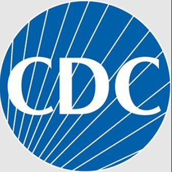

# Project Title Here

README.md includes concise summary of project with all data science steps

README.md links to presentation and sources

README.md includes instructions for navigating the repository

For this project, the README.md file should contain:

- [ ] Overview
- [ ] Business and Data Understanding
- [ ] Explain your stakeholder audience and dataset choice here
- [ ] Modeling
- [ ] Evaluation
- [ ] Conclusion

Although most people today associate the coronavirus with a pandemic, just over a decade ago another contagion raced around the globe. During the spring of 2009, a novel strain of influenza A emerged. This new type of H1N1 virus, commonly referred to as "swine flu," affected 60 million people worldwide and caused between 151,000-575,400 deaths in the first year of its appearance. Unlike the seasonal flu, H1N1 largely sickened young people owing to the presence of familiar H1N1 antibodies in older individuals who had been exposed to a similar pathogen earlier in their lives. A vaccine to this novel H1N1 virus was developed that fall, but it was too late to be included in the seasonal flu vaccine for that year. This necessitated receiving 2 different flu vaccines for the flu season of 2009-10, especially for those considered highest at risk.

To help monitor H1N1 and seasonal vaccine rates, the Centers for Disease Control (CDC), in conjunction with the National Center for Immunization and Respiratory Diseases (NCIRD) and the National Center for Health Statistics (NCHS), conducted a phone survey throughout the United States from September 2009 through June 2010. The target population was anyone living in the country who was at least 6 months old. In addition to seeing if the respondent had received the seasonal flu and/or H1N1 vaccine, the survey also gathered data on respondents' views about vaccine safety and effectiveness, precautionary measures they took to avoid getting the flu, their level of concern about becoming sick from the flu, and basic demographic information. Over 56,000 household interviews were conducted, with around 20% of those being households with children. These interviews comprise the 
